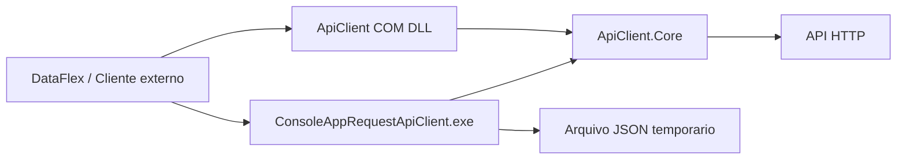

# Arquitetura

## Objetivo

A aplicacao deve funcionar como uma ponte simples entre sistemas legados, especialmente DataFlex, e APIs HTTP modernas. Ela oferece dois modos de consumo:

- DLL COM para clientes capazes de instanciar componentes COM.
- Executavel para clientes que preferem chamar um processo externo e ler a resposta em arquivo.

## Projetos

### ApiClient.Core

Projeto `netstandard2.0` com a regra principal da aplicacao.

Responsabilidades:

- Validar os parametros basicos de uma requisicao.
- Executar chamadas HTTP `GET`.
- Configurar headers HTTP comuns.
- Padronizar sucesso e erro em `ApiResponse`.
- Gravar resposta em arquivo quando necessario.

Classes principais:

- `ApiRequestOptions`: representa `baseAddress`, `endpoint` e `token`.
- `ApiResponse`: representa sucesso, conteudo e erro.
- `IApiRequestService`: contrato para execucao de requisicoes.
- `HttpApiRequestService`: implementacao HTTP baseada em `HttpClient`.
- `FileApiResponseWriter`: grava conteudo em arquivo.

### ApiClient

Projeto `.NET Framework 4.8` exposto via COM.

Responsabilidades:

- Manter compatibilidade com consumidores COM.
- Preservar a assinatura publica `RequestGetAsyncApi`.
- Delegar a regra de negocio para `ApiClient.Core`.

Evite colocar novas regras de HTTP diretamente neste projeto. Ele deve ser apenas uma camada de adaptacao.

### ConsoleAppRequestApiClient

Projeto `.NET 8` executavel.

Responsabilidades:

- Ler argumentos de linha de comando.
- Chamar `ApiClient.Core`.
- Gravar a resposta no arquivo temporario informado.
- Retornar codigo `0` em execucao aceita e `1` quando faltarem argumentos.

## Fluxo de chamada

## Como adicionar novas funcionalidades

1. Crie ou altere a regra no `ApiClient.Core`.
2. Exponha a funcionalidade no projeto `ApiClient` se ela precisar estar disponivel via COM.
3. Exponha a funcionalidade no `ConsoleAppRequestApiClient` se ela precisar estar disponivel por linha de comando.
4. Documente o contrato de entrada e saida no README.

Exemplos de evolucao:

- Suporte a `POST`, `PUT` e `DELETE`.
- Headers customizados.
- Timeout configuravel.
- Retorno de status code separado do corpo.
- Gravacao de logs.
- Tratamento de erros em JSON padronizado.

## Convencoes recomendadas

- Mantenha `ApiClient.Core` sem dependencia de COM, console ou DataFlex.
- Preserve compatibilidade de metodos COM existentes sempre que possivel.
- Evite duplicar chamadas HTTP fora do `HttpApiRequestService`.
- Prefira objetos de entrada e saida claros em vez de muitos parametros soltos.
- Quando um erro precisar ser consumido pelo DataFlex, retorne texto simples ou JSON padronizado, mas documente o formato.
